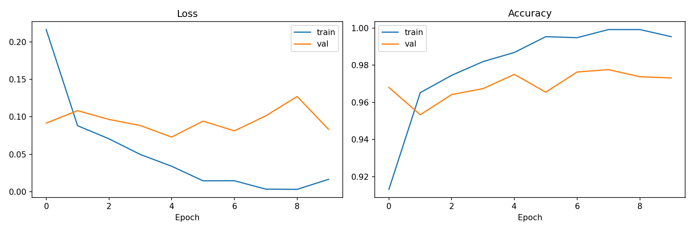

# Pneumonia Detector

PyTorch project for classifying chest X-rays as NORMAL or PNEUMONIA.

**Status:** in progress

## Dataset
[Chest X-Ray Images (Pneumonia)](https://www.kaggle.com/datasets/paultimothymooney/chest-xray-pneumonia)

The original validation folder contains only 16 images, so the training set is re-split 70/30 into train and validation (fixed seed for reproducibility).

## Preprocessing
- Grayscale, resized to 224×224
- Normalized to the range [-1, 1]

## Model
A CNN built from scratch:
- 3 convolutional blocks (Conv → ReLU → MaxPool) with 32, 64 and 128 filters
- 2 fully connected layers (256 → 2)
- Loss: CrossEntropyLoss, optimizer: Adam

## Training
Trained for 10 epochs.

| | Loss | Accuracy |
|---|---|---|
| Train | 0.018 | 99.3% |
| Validation | 0.079 | 97.3% |

Best validation loss (0.062) was reached at epoch 8. After that validation loss started to rise while training loss kept falling, a sign of the beginning of overfitting.

