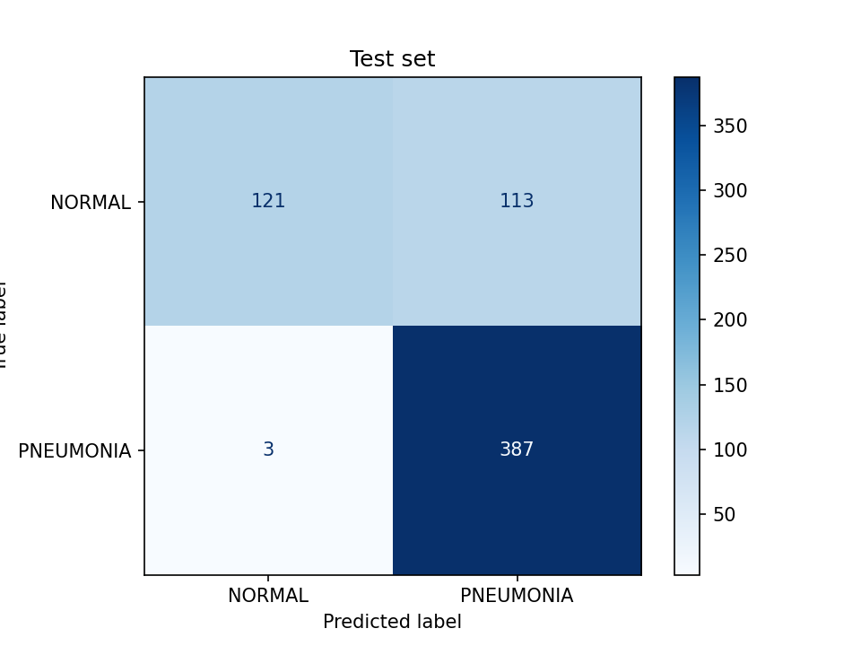

# Pneumonia Detector

A CNN built from scratch in PyTorch to classify chest X-rays as NORMAL or PNEUMONIA.

**Status:** baseline complete, improvements in progress

## Dataset
[Chest X-Ray Images (Pneumonia)](https://www.kaggle.com/datasets/paultimothymooney/chest-xray-pneumonia)

| Split | Images |
|---|---|
| Train | 3,652 |
| Validation | 1,564 |
| Test | 624 |

The original validation folder contains only 16 images, so the training set is re-split 70/30 into train and validation with a fixed seed.
Training data is imbalanced: about 3 pneumonia images for every normal one.

## Preprocessing
- Grayscale, resized to 224×224
- Normalized to the range [-1, 1]

## Model
- 3 convolutional blocks (Conv → ReLU → MaxPool) with 32, 64 and 128 filters
- 2 fully connected layers (256 → 2)
- Loss: CrossEntropyLoss, optimizer: Adam (lr = 0.001)
- Trained for 10 epochs on a Kaggle GPU; the checkpoint with the lowest validation loss is kept

## Training

Validation loss reached its minimum (~0.073) at epoch 5. After that training loss kept falling towards zero while validation loss rose, a clear sign of overfitting. Validation accuracy stayed around 97%.

## Test results
Evaluated once on the held-out test set using the best checkpoint.

| Class | Precision | Recall |
|---|---|---|
| NORMAL | 0.987 | 0.321 |
| PNEUMONIA | 0.710 | 0.997 |

**Accuracy: 81.4%**

The model detects almost every pneumonia case (389 of 390) but classifies most healthy patients as sick (159 of 234 false positives).

## What I learned
Validation accuracy (97%) was far too optimistic. The validation set comes from the same folder as the training data, while the test set was collected separately, so it reveals a distribution shift.
Combined with the 3:1 class imbalance, the model learned that predicting pneumonia is the safe choice.
For screening, missing only one sick patient is good, but a 32% recall on healthy patients would mean too many false alarms in practice.

## How to run
1. Download the dataset from Kaggle
2. Install dependencies: `pip install -r requirements.txt`
3. Open `notebooks/pneumonia_detection.ipynb` and update `DATA_PATH`
